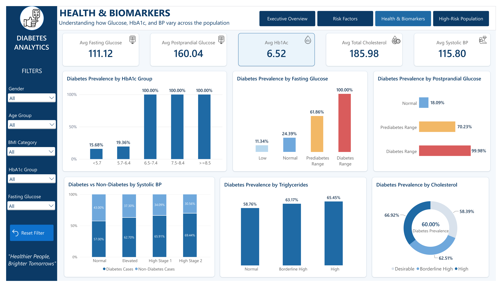
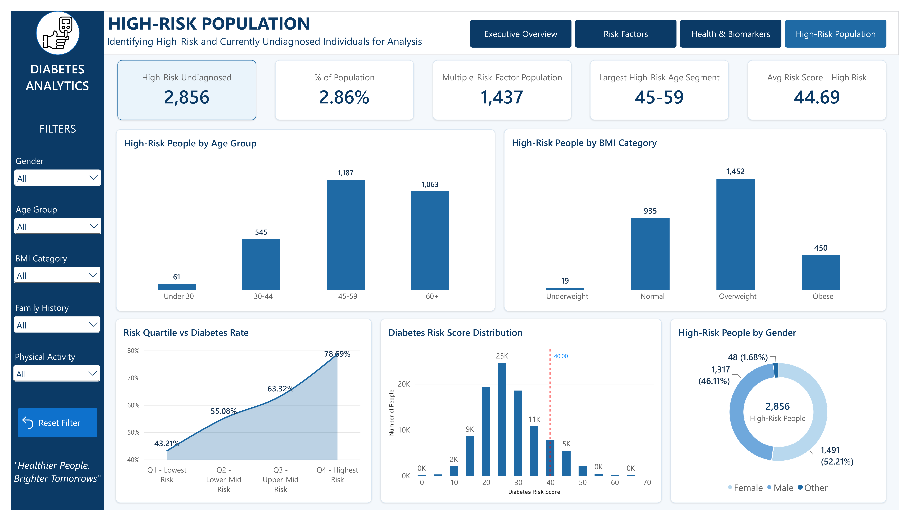

# 🩺 Diabetes Risk & Health Analytics

## 📌 Project Overview

**Diabetes Risk & Health Analytics** is an end-to-end data analytics project focused on understanding diabetes prevalence, identifying associated health and lifestyle risk factors, and segmenting high-risk population groups.

The project analyzes **100,000 records and 31 variables** covering demographics, lifestyle behaviors, medical history, body measurements, health indicators, biomarkers, diabetes risk scores, and diabetes outcomes.

The project follows a complete analytics workflow using **Python, PostgreSQL, and Power BI**.

---

## 🎯 Business Objective

The objective of this project is to transform raw healthcare data into actionable analytical insights by answering key questions such as:

* What is the overall diabetes prevalence?
* Which demographic groups show higher diabetes prevalence?
* Which lifestyle and health factors are associated with higher prevalence?
* How do glucose and HbA1c levels differ across diabetes groups?
* How does diabetes prevalence change across risk-score segments?
* How many high-risk individuals are currently undiagnosed?
* Which population segments should receive greater attention for preventive monitoring?

---

## 📊 Dataset

| Attribute       | Details                      |
| --------------- | ---------------------------- |
| Records         | 100,000                      |
| Variables       | 31                           |
| Domain          | Healthcare / Diabetes Risk   |
| Target Variable | `diagnosed_diabetes`         |
| Target Values   | 0 = No, 1 = Yes              |
| Analysis Tools  | Python, PostgreSQL, Power BI |

### Main Data Categories

* Demographics
* Lifestyle & behavioral factors
* Medical history
* BMI & body measurements
* Blood pressure & vital signs
* Lipid profile
* Glucose & other biomarkers
* Diabetes risk score
* Diabetes stage & diagnosis

---

## 🔄 Project Workflow

```text
Raw Healthcare Dataset
          ↓
Python
Data Cleaning & Validation
          ↓
Python
Exploratory Data Analysis
          ↓
PostgreSQL
Business & Advanced Analysis
          ↓
Power BI
Data Modeling & DAX
          ↓
Interactive Dashboard
          ↓
Insights & Recommendations
```

---

## 🐍 Python — Data Cleaning & EDA

Python was used for data preparation and exploratory analysis.

### Data Cleaning & Validation

* Inspected dataset structure and data types
* Checked missing values
* Checked duplicate records
* Reviewed categorical consistency
* Generated descriptive statistics
* Identified potential outliers using the IQR method
* Reviewed extreme values using domain context

### Exploratory Data Analysis

EDA was performed across:

* Demographics
* Lifestyle behaviors
* Medical history
* BMI and body measurements
* Blood pressure
* Lipid profile
* Glucose and HbA1c
* Diabetes risk score and outcomes

---

## 🗄️ SQL — PostgreSQL Analysis

PostgreSQL was used for business-focused and advanced analytical analysis.

### Analysis Performed

* Data validation
* KPI calculation
* Diabetes prevalence analysis
* Demographic segmentation
* Lifestyle analysis
* Medical and health-factor analysis
* Biomarker analysis
* Diabetes Stage Analysis
* High-risk population identification
* Risk-score quartile analysis
* Multiple-risk-factor analysis
* Advanced population segmentation

### SQL Techniques

* `CASE`
* `GROUP BY`
* Aggregate functions
* `CTE`
* `HAVING`
* `UNION ALL`
* Window functions
* `NTILE()`
* `RANK()`
* `CORR()`

---

## 📈 Power BI Dashboard

The final Power BI report contains four interactive dashboard pages.

### 01 — Executive Overview

Provides an overall view of:

* Total population
* Diabetes prevalence
* Age groups
* BMI categories
* Gender
* Risk-score quartiles

### 02 — Risk Factors

Analyzes:

* Family history
* Physical activity
* Diet quality
* Hypertension
* Smoking
* BMI-related risk patterns

### 03 — Health & Biomarkers

Focuses on:

* Fasting glucose
* Postprandial glucose
* HbA1c
* Cholesterol
* Triglycerides
* Blood pressure

### 04 — High-Risk Population

Focuses on:

* High-risk undiagnosed population
* High-risk population percentage
* Multiple risk factors
* Risk-score distribution
* Age and BMI segmentation
* Risk quartile vs diabetes prevalence

---

## 🧮 DAX & Data Modeling

Power BI was used to create calculated measures and analytical segments.

### Key Measures

* Total People
* Diabetes Cases
* Non-Diabetes Cases
* Diabetes Prevalence %
* Average Risk Score
* Average BMI
* Average HbA1c
* Average Fasting Glucose
* High-Risk Undiagnosed
* High-Risk Undiagnosed %
* Multiple Risk Factor Population

### Calculated Segments

* Age Group
* BMI Group (BMI Category)
* Diet Group
* Sleep Group
* Risk Quartile
* Gender Sort

---

## 📊 Dashboard Preview

### 1. Executive Overview


### 2. Risk Factors


### 3. Health & Biomarkers


### 4. High-Risk Population



---

## 🔎 Key Findings

### Diabetes Prevalence

**59,998 out of 100,000 individuals** were diagnosed with diabetes, resulting in an overall prevalence of **60.00%**.

### Family History

Diabetes prevalence was:

* **78.29%** with a recorded family history
* **54.86%** without a recorded family history

**Difference: 23.43 percentage points**

### Physical Activity

Diabetes prevalence was:

* **62.60%** in the low physical-activity group
* **46.52%** in the high physical-activity group

**Difference: 16.08 percentage points**

### BMI

Diabetes prevalence was:

* **68.28%** among the obese group
* **55.96%** among the normal-BMI group

**Difference: 12.32 percentage points**

### Risk Score

Diabetes prevalence increased across risk-score quartiles:

| Risk Quartile       | Diabetes Prevalence |
| ------------------- | ------------------: |
| Q1 — Lowest Risk    |              43.21% |
| Q2 — Lower-Mid Risk |              55.08% |
| Q3 — Upper-Mid Risk |              63.32% |
| Q4 — Highest Risk   |              78.69% |

### High-Risk Population

Using the project's analytical definition of **risk score ≥40 and diagnosed diabetes = 0**, **2,856 individuals** were identified as high-risk and currently undiagnosed.

This represents **2.86% of the total population**.

The largest high-risk age segment was **45–59 years**, with **1,187 individuals**.

### Biomarkers

Glucose and HbA1c showed particularly strong differences in diabetes prevalence across their analytical categories.

---

## 💡 Recommendations

Based on the observed patterns:

1. **Prioritize high-risk population segments** for further assessment and preventive monitoring.
2. **Use risk-score segmentation** to identify groups requiring greater analytical attention.
3. **Focus on modifiable lifestyle factors** such as physical activity, diet quality, and healthy body weight.
4. **Incorporate family history** into population-level risk segmentation.
5. **Monitor glucose and HbA1c** as important indicators in diabetes-related analysis.
6. Use the Power BI dashboard for **interactive monitoring and population-level reporting**.

---

## 🛠️ Tools & Technologies

| Tool              | Purpose                         |
| ----------------- | ------------------------------- |
| 🐍 Python         | Data Cleaning, Validation & EDA |
| 🗄️ PostgreSQL    | SQL & Advanced Analysis         |
| 📊 Power BI       | Data Modeling & Visualization   |
| 📐 DAX            | Measures & Calculated Columns   |
| 📝 Microsoft Word | Project Documentation           |

---

## 📁 Project Structure

```text
Diabetes-Risk-Health-Analytics/
│
├── 01_Data/
│   ├── diabetes_dataset.csv
│   └── diabetes_dataset_clean.csv
│
├── 02_Python/
│   └── diabetes_eda.ipynb
│
├── 03_SQL/
│   ├── 01_import_data.sql
│   ├── 02_data_overview.sql
│   ├── 03_kpi_analysis.sql
│   ├── 04_demographic_analysis.sql
│   ├── 05_lifestyle_analysis.sql
│   ├── 06_medical_history_analysis.sql
│   ├── 07_health_analysis.sql
│   ├── 08_diabetes_biomarkers_analysis.sql
│   ├── 09_diabetes_stage_analysis.sql
│   ├── 10_high_risk_people_analysis.sql
│   └── 11_advanced_analysis.sql
│
├── 04_Power_BI/
│   └── diabetes_risk_dashboard.pbix
│
├── 05_Documents/
│   └── Diabetes_Risk_Health_Analytics_Project_Report.pdf
│
├── 06_Images/
│   ├── 01_executive_overview.png
│   ├── 02_risk_factors.png
│   ├── 03_health_and_biomarkers.png
│   └── 04_high_risk_population.png
│
└── README.md

---

## 📌 Limitations

* The findings are based on the available dataset and may not represent the broader population.
* The analysis identifies associations and patterns rather than causal relationships.
* Some categories were created specifically for analytical segmentation.
* High-risk classification does not represent a clinical diagnosis.
* The analysis is intended for data analytics and population-level insight rather than individual medical advice.

---

## 🏁 Conclusion

This project demonstrates an end-to-end data analytics workflow, combining **Python for data preparation and EDA, PostgreSQL for business and advanced analysis, and Power BI for data modeling, DAX, visualization, and interactive reporting**.

The analysis provides a structured view of diabetes prevalence, associated risk patterns, health indicators, and high-risk population segments while translating analytical findings into actionable recommendations.

---

## 👤 Author

**Imran Ansari**

**Aspiring Data Analyst**

**Skills:** Python | SQL | Excel | Power BI | DAX | Data Analysis

---

> **Disclaimer:** This project is intended for analytical and educational purposes. Findings represent patterns observed within the dataset and should not be interpreted as clinical diagnoses or causal relationships.
